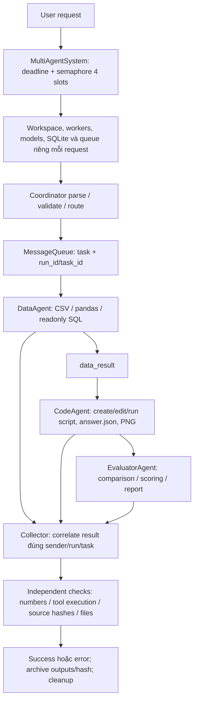
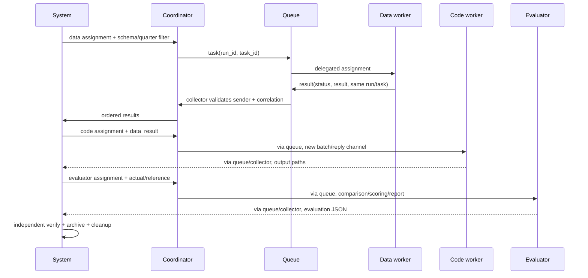

# Báo cáo cuối Phần 0–6 — Coordinator, Workers & Tools

**Trần Quốc Vương — 2A202602522.** Repo: `K4-DAY20-MULTIAGENTS-TranQuocVuong-2A202602522`. Báo cáo này đáp ứng checklist multi-agent được gửi bổ sung. Báo cáo thí nghiệm **Deep Agents/self-evolving** theo README gốc vẫn ở [`../../../report/REPORT.md`](../../../report/REPORT.md); không cộng hai hệ thống thành một benchmark.

## 1. Tổng quan bài lab

Bài toán là điều phối yêu cầu qua Data, Code, Evaluator workers; mỗi worker có prompt và tools chuyên môn, Coordinator parse/route/execute/aggregate, queue chuyển task/result, hệ thống kiểm chứng độc lập đầu ra. Mục tiêu gồm handoff đúng, request isolation, timeout/cancellation hữu hạn, test lặp lại được và đo chất lượng/latency/token bằng evidence thật.

Phạm vi thực tế: package `day20_multiagents` trong extension, chạy Linux/Python **3.12.15** qua Docker trên Windows. `MultiAgentSystem` là **fixture workflow Q3 cố định**, không chatbot tự xử lý mọi database: table/CSV có `quarter, amount`; Q3 gồm 40, 50, 60 và Q1=900. Data phải lấy tổng và số bản ghi Q3; Code tạo script/answer, complex thêm biểu đồ; Evaluator comparison/scoring/report. Checker riêng kỳ vọng revenue=150, rows=3 và kiểm file/tool/hash thật; không cấp hai đáp án này vào assignment Data/Code.

Hệ thống có **bốn vai trò**, nhưng chỉ **ba LLM workers**: Coordinator của fixture dùng parser/routing tất định (`model=None`), không thêm lần gọi model để điều phối. Live workers dùng YesScale/`gpt-4.1-mini`, temperature=0; offline driver chỉ mô phỏng tool loop. Part 6 thêm bonus **6c — read-only result caching** riêng, không đổi `MultiAgentSystem` hoặc benchmark live đã lưu. Không sửa `src/lab/`, root tests/tasks/scripts, skills, hypotheses hoặc tag freeze.

## 2. Kiến trúc design

Sơ đồ biểu diễn complex data → code → evaluator. Data-only/code-only/evaluation-only chỉ chạy role được route; không gọi mọi worker cho mọi request. `Coordinator.execute_tasks()` cho workers khác nhau chạy song song, task cùng worker chạy nối tiếp. `MultiAgentSystem._run()` chia complex thành ba batch phụ thuộc: không chạy Code trước khi Data trả kết quả.

| Component | Trách nhiệm và code |
| --- | --- |
| Coordinator | `coordinator.py`: kiểm request/task, route registry, dispatcher mỗi worker, một collector, aggregate success/partial/error, retry có điều kiện |
| BaseWorker + workers | `agents/`: full LangChain message history, schemas, ToolMessage với name/call ID; process sync/native async, tối đa 12 iterations mặc định và 16 tool calls/response |
| MessageQueue | `communication/message_queue.py`: bounded `asyncio.Queue`, backpressure, timeout, snapshot logs; chỉ một event loop/process |
| Tools | `tools.py`, `toolkits/`: BaseTool validation; SQL readonly; CSV/numeric aggregates; subprocess/file operations; reference validation/scoring/report |
| E2E system | `system.py`: fixture/resources request-local, admission/deadline 90s, ordered handoffs, independent checks và artifact archive trước cleanup |
| Observability | `observability.py`: model/tool spans, actual usage metadata hoặc null, JSON logs không chứa raw tool payload |
| Optional cache | `caching.py`: wrapper chỉ reuse kết quả data đã verified, scope/revision/namespace, TTL/LRU/bounds; không bật trong benchmark Phần 5 |

### Communication protocol

Envelope task gồm `type="task"`, `content`, `parameters`, `run_id`, `task_id`. Queue tự thêm `from`, `to`, UUID `id`, UTC `timestamp`. Envelope result gồm `type="result"`, cùng `run_id/task_id`, `worker`, `status`, `result` và `error` khi lỗi. Collector chỉ nhận đúng sender cho task, không nhận result trùng/stale/khác run; trả theo thứ tự input, không thứ tự hoàn tất.

Giới hạn mặc định: **64 messages/queue**, **64 KiB/message**, log giữ **1000 entries**, tối đa **32 tasks/batch**. Queue đầy chờ consumer và có send timeout, **không drop-oldest task**; log cũ tự hết hạn theo deque, khác với mất message đang xử lý. Reply channel riêng `coordinator:<run_id>` được dọn ở finally. Chưa có schema version, broker durability, acknowledgement nghiệp vụ hoặc exactly-once delivery.

Ba câu làm quen: (1) Coordinator điều phối, ba workers chuyên Data/Code/Evaluation; (2) giao tiếp bằng async queue và structured task/result correlation, không shared toàn bộ model history; (3) các workers chia sẻ hợp đồng BaseTool/validation/logging, nhưng registry tool theo role, không phải worker nào cũng có SQL hoặc Python. Bài Deep Agents gốc có câu trả lời riêng tại mục 3 báo cáo chính.

## 3. Implementation details

| Quyết định | Lý do, trade-off và kiểm chứng |
| --- | --- |
| Async orchestration | Phù hợp API/I/O waits; native `ainvoke` có cancellation. Sync adapter dùng `to_thread`, không vì GIL mà CPU Python tự song song; cancel coroutine không giết thread |
| Request-local resources | Mỗi request có worker/model/queue/workspace/SQLite riêng; test mười concurrent requests không trộn identity/history. Đổi lại phải tạo fixture/resources mỗi lượt |
| Readonly SQLite cached connection | `mode=ro`, authorizer chặn write/DDL/load_extension, RLock bảo vệ cached connection trước thread calls; close khi request kết thúc. Đây không là DB connection pool distributed |
| Bound input/output | CSV tối đa 1 MiB/10k rows, SQL fetch default 500/configurable 1–1000, file text 64 KiB, numeric allowlist không eval; dữ liệu lớn cần pagination/streaming |
| Code execution ở subprocess | Linux RLIMIT_AS mặc định 512 MiB, CPU theo timeout, file-size 64 KiB/FD=64, stdout/stderr 8 KiB, timeout kill process group; env tối thiểu không chứa key. Đây **không phải security sandbox**, trusted code only |
| Filesystem guards | Resolve workspace paths, chặn traversal/symlink escape, create không overwrite, edit đúng một match; không bảo đảm an toàn trước adversarial race từ tiến trình cùng quyền |
| Independent verification | Status “success” của worker không đủ: kiểm numbers/source SHA256/tool event/script/PNG decode/report. Hai live request bị loại dù một worker hoặc file trông có vẻ đúng |
| Full tool history | Giữ ToolMessage name/call ID và mọi tool calls, không bỏ kết quả trung gian; thêm vòng model tăng token/latency, cần iteration guard |
| Explicit assignment/schema | Sửa lỗi worker đoán cột date/revenue và giao sai phần việc bằng table/CSV schema, COUNT/filter và role-only instructions; không sửa fixture/checker |
| Cache opt-in | Chỉ kết quả read-only verified, không reuse files/traces/token counters; giảm repeated work nhưng cần trusted scope/revision và explicit policy namespace |

Scoring weights 30/30/20/20 với ratings supplied 85/90/80/85 cho **85.5/B**. Đây là unit/demo input tính công thức, **không** accuracy hoặc judge score LLM. ReportGeneratorTool kiểm schema `score, feedback, issues, suggestions`, không nhận thêm fields tùy tiện. `MultiAgentSystem` reference là checker cho fixture, không benchmark general reasoning.

## 4. Test results

Phần 5 snapshot **57 passed in 11.95s**, coverage **92.2535%** (1048/1136 statements) được giữ nguyên. Sau bonus Phần 6: **68 passed in 12.79s**, statement coverage **92.6650%** (1137/1227), cache module 89/91 statements. Nguồn: [`../evidence/part6-tests.txt`](../evidence/part6-tests.txt), [`../evidence/part6-coverage.json`](../evidence/part6-coverage.json). Coverage không gồm branch coverage, scripts, SDK hoặc Python do model sinh.

| Test file | Passed | Hành vi chính |
| --- | ---: | --- |
| test_02_coordinator.py | 10 | Parse/route/aggregate, parallel correlation, same-worker serialization, partial timeout, idempotent retry, cancel/reuse |
| test_03_workers.py | 8 | Data/Code/Evaluator, tool history/IDs, schema/model/input/iteration failures |
| test_04_tools.py | 4 | SQL/Python/file/scoring checkpoint |
| test_05_integration.py | 14 | Request-to-result, E2E complex, ten concurrent requests, timeout/cancel/crash/wrong answer, metadata/stats/logs/config/artifacts |
| test_06_caching.py | 11 | Actual data E2E hit, fresh UUID/zero work, scope/revision isolation, mutation copies, TTL/LRU/bounds, bypass/error/cancellation/concurrent miss |
| test_communication.py | 4 | Round trip, snapshots, size, backpressure/timeout |
| test_integration.py | 1 | Coordinator ↔ real workers/tools/queue |
| test_tool_collaboration.py | 1 | SQL → script/PNG → comparison/report |
| test_tool_guardrails.py | 8 | SQL recovery/thread locking, output/resource limits, schemas/paths, script execution semantics |
| test_tools.py | 7 | CSV/SQL/file/edit/Python/evaluation safety behavior |
| **Tổng extension** | **68** | Offline, không API key/network |

Không phân loại toàn bộ 68 là “unit” vì có test chạm tools/subprocess/files thật. Mock model tests chứng minh plumbing/guardrails, không chất lượng model. Offline performance E2E **19/19**, live **17/19**; phải báo hai kết quả riêng. Checkpoint Coordinator standalone 3/3, tools checkpoint 4/4, collaboration demo 3/3 có evidence từ các phần trước.

Bài chính có **29 tests riêng**, không gộp thành 97 tests do giảng viên cung cấp. Main official artifacts vẫn 18 runs, freeze verifier kiểm sáu skill-condition runs; các log tự kiểm Phần 6 được lưu riêng ở `report/offline-tests-part6.txt`, `report/freeze-check-part6.txt`.

## 5. Performance analysis

### 5.1. Live — YesScale/gpt-4.1-mini

Nguồn [`../evidence/part5-live-final/benchmark_results.json`](../evidence/part5-live-final/benchmark_results.json). Ba lần/case, thêm mười data requests đồng thời với bốn slots, fixture sạch mỗi request. SDK timeout=30s, max_retries=2; whole-request deadline=90s gồm admission. Cache **không bật**. Mọi số gồm cả request lỗi.

| Case | Verified | Min/Max (s) | Avg (s) | P50 (s) | P99 (s) | Req/min | Token |
| --- | ---: | ---: | ---: | ---: | ---: | ---: | ---: |
| Simple data query | 3/3 | 2.795 / 4.120 | 3.465 | 3.482 | 4.107 | 17.31 | 3231 |
| Code generation | 2/3 | 6.791 / 9.623 | 8.148 | 8.029 | 9.591 | 7.36 | 7386 |
| Complex workflow | 2/3 | 21.854 / 27.718 | 24.752 | 24.685 | 27.657 | 2.42 | 23931 |
| Concurrent data (10 req) | 10/10 | 3.427 / 12.713 | 6.905 | 6.251 | 12.442 | 47.09 | 10768 |

Tổng **17/19 = 89.47% verified**, error **10.53%**, **45316 token** và **66 logical model invocations**. Token lấy usage metadata, không estimator. SDK retry nội bộ không tăng logical count; không là số HTTP requests/hóa đơn chắc chắn. Không có tariff/invoice YesScale được kiểm chứng nên USD **null**. Không áp giá OpenAI vào gateway.

P99 nội suy tại `(n−1)*fraction`; ba hoặc mười mẫu **không đủ** xác nhận tail SLO. Throughput là completed requests/batch wall-time ×60, gồm lỗi và closed-loop; không sustained production capacity. Latency gồm admission wait và kiểm chứng. Token/100 là ngoại suy: simple 107700, code 246200, complex 797700, concurrent data 107680; chưa thực sự chạy 100 requests.

### 5.2. Offline và bottlenecks

[`../evidence/part5-offline-final/benchmark_results.json`](../evidence/part5-offline-final/benchmark_results.json): **19/19**, zero API/token. P50 simple/code/complex/load = **0.025545/0.174190/1.223331/0.106353s**; P99 = **0.029624/0.237113/1.435022/0.146783s**. Throughput tương ứng **2266.31/308.89/47.92/2761.11 req/min**. Đây là local plumbing, không thay live quality/latency.

Trong complex offline, code stage chiếm **89.74%** wall-time: startup subprocess/matplotlib đáng đo riêng. Live complex có model spans **70.308s**, tool spans **3.617s** trên **74.258s** batch: bottleneck chủ yếu là API/model waits và số vòng gọi model, **không có evidence rate-limit là nguyên nhân**. Load live data worker occupancy **78.33%** của bốn slots; occupancy gồm API waits, không CPU utilization. cProfile Phần 5 có 72198 calls/1.588s, selectors/select 1.417s và subprocess communicate 1.398s; inclusive async timings overlap, không cộng cumulative times thành CPU tổng.

### 5.3. Resource usage đo thêm, không chép số ví dụ

[`../scripts/measure_resources.py`](../scripts/measure_resources.py) chạy **offline Linux**, một simple/code/complex rồi mười concurrent data requests, tổng **13/13 verified**. [`../evidence/part6-resources/resource_results.json`](../evidence/part6-resources/resource_results.json) lưu before/after `getrusage`, RSS samples, CPU deltas và records. Parent RSS sau import/before simple **93200 KiB ≈ 91.02 MiB**.

| Phase | Wall (s) | Sampled parent peak RSS (KiB) | Parent CPU (% một core) | Terminated children CPU delta (s) |
| --- | ---: | ---: | ---: | ---: |
| Simple (1 req) | 0.0261 | 94272 | 38.25% | 0 |
| Code (1 req) | 0.2436 | 94272 | 9.62% | 0.1370 |
| Complex (1 req) | 1.5719 | 96360 | 6.31% | 1.2152 |
| Concurrent data (10 req, 4 slots) | 0.1778 | 98932 | 22.36% | 0 |

Parent CPU = delta user+system / phase wall ×100, gồm worker threads và probe overhead; excludes children. Child CPU cho thấy code/matplotlib làm việc trong subprocess, không được suy parent CPU thấp là toàn hệ thống idle. RSS lấy `/proc/self/status` mỗi khoảng 5ms, có thể bỏ lỡ đỉnh; không cộng child RSS, không đo LLM server, không toàn container. `ru_maxrss` là lifetime high-water mark, child max không tổng peaks; không rút ra “+10 MB/request” từ các phase nối tiếp. SQL mỗi active request tối đa một cached readonly connection; phase này không tự đo connection counts hoặc load live resources.

## 6. Error analysis & resilience

| Hiện tượng/evidence | Nguyên nhân | Xử lý và phần chưa giải quyết |
| --- | --- | --- |
| `part5-live/`: 0/19, OpenAIConnectionError, usage thiếu | Docker env-file giữ dấu nháy endpoint/key, khác dotenv | Chuẩn hóa đúng một cặp nháy; regression test; không in key. Lỗi setup giữ nguyên, usage null không thành số 0 |
| `part5-live-fixed/`: 4/19; `{"revenue":150,"rows":4}`, `KeyError: 'revenue'`, `no such column: date` | Worker đoán schema, COUNT toàn CSV, lẫn role assignment | Supply schema/quarter filter/COUNT và scope từng worker; không sửa checker/source. Hai lần chạy khác code/prompt, không controlled ablation |
| Final code request `f291fb4f-22ee-4e71-9ad4-bbc9c14f8fd6` có rows là list ba records | Output JSON contract chưa được model tuân thủ | `code_numbers=false`, system error; giữ script/answer/hashes. Cần JSON schema rows integer và repair có giới hạn trước success |
| Final complex request `a291d855-8134-4631-a2f0-03cb89fffc1b`: `NameError: name 'os' is not defined` sau khi có PNG | Model giả định globals/import tồn tại qua các REPL calls; thực tế mỗi call subprocess mới | Tool/worker error, không gọi thành công chỉ vì PNG tồn tại. Cần self-contained imports hoặc chỉ execute script đầy đủ; chưa áp fix vào run đã đo |

Hai errors live cuối giữ nguyên, không rerun chọn số đẹp. Chi tiết và câu trả lời/artifact nằm ở [`REPORT.md`](REPORT.md) mục 6.3 và thư mục evidence từng run. Model metadata của live-fixed+final **74866 token**, không tính run setup thiếu usage là 0 và không cộng extension vào **908894 official task tokens** bài chính.

Resilience thực thi: validated request/envelopes, independent source/numeric/artifact checks, bounded queue/log/message/tool loops, deadline/cancel/drain, partial batch results, explicit worker errors, SQL authorizer/progress bound, subprocess timeout/resource limits. Retry Coordinator chỉ `idempotent=True`, tối đa ba retries; deadline mỗi attempt, không chung tất cả retries. E2E có outer deadline toàn request và không thêm retry nghiệp vụ quanh file/code side effects; SDK model retry hữu hạn không là retry task.

Không có fallback worker, circuit breaker, durable delivery, coordinator failover hoặc distributed recovery. Request-local resources giúp cô lập lỗi giữa concurrent requests trong một process, không sống sót process crash. Native async cancel được test; sync thread vẫn có thể chạy đến timeout riêng. Không tự chấm “resilience 8/10” khi không có rubric đo tương ứng.

## 7. Design vs implementation

Các target dưới đây từ checklist Phần 5, không phải cam kết đã đạt của lab.

| Dự kiến/target | Thực tế | Đánh giá |
| --- | --- | --- |
| Coordinator + ba workers đúng roles | Bốn vai trò, ba LLM workers, handoff qua queue; Coordinator fixture tất định | Đạt phạm vi fixture, chưa generic autonomy |
| Latency P50<5s, P99<15s | Simple 3.482/4.107s; code 8.029/9.591s; complex 24.685/27.657s; load 6.251/12.442s | Simple đạt thresholds mẫu; code/complex/load không đạt đủ. Không chứng minh tail SLO |
| Throughput>10 req/min | Simple 17.31; code 7.36; complex 2.42; data load 47.09 | Chỉ simple/load vượt trong closed-loop test |
| Error<1% | 2/19 = 10.53% | Chưa đạt, lỗi schema và REPL state còn tồn tại |
| Coverage≥80%, 23+ tests | 68/68 pass, 92.6650% statement coverage | Đạt trong test scope offline |
| Python “sandbox” | Bounded subprocess, minimal env, filesystem/network theo quyền container | Resource control, không adversarial security boundary |
| Scalable system | Semaphore bốn request, request-local workers, queue in-process | Concurrency cục bộ, chưa distributed |
| Cache giảm repeated work | 20 identical readonly requests: 40 → 2 scripted model calls | Có evidence offline; không chứng minh live token/USD savings |

Điều làm tốt: correlation/cancel/reuse có test, independent checks bắt được “success” giả, giữ cả lỗi và usage thiếu. Điều khó: async traces và provenance, schema/role mơ hồ, shell/env trên Windows khác Linux, script/subprocess state khác suy đoán model. Bài học là tách orchestration correctness khỏi LLM success, version contract trước scale, đo ở đúng boundary và không dùng fake throughput để khẳng định production.

## 8. Scalability analysis

- **More requests:** `MultiAgentSystem.max_concurrency` cấu hình 1–16, default 4; mỗi request tạo Coordinator riêng, không phải bonus coordinator pool có load balancing/failover. Tăng slots tăng API waits, connections/artifact load; cần benchmark paced mixed traffic/rate-limit thực trước tuning.
- **More workers:** Coordinator registry route theo tên và một consumer/worker; thêm replicas cần availability/capability registry, scheduling, idempotency và per-worker state isolation. Không đổi tên worker để giả có capability thay thế.
- **More processes/machines:** asyncio queues/cache/semaphore không shared; cần broker bền vững, worker acknowledgements, request IDs, storage/artifacts dùng chung và distributed admission. Một process crash mất pending work/cache.
- **Larger data/tasks:** fetch/CSV/message/file caps sẽ từ chối hoặc giới hạn dữ liệu, không streaming. Cần pagination/chunked handoffs, schema contracts và workspace quotas; không chỉ tăng limit vô hạn.
- **Repeated readonly tasks:** cache có thể giảm work trong cùng process/scope/revision; cold concurrent requests vẫn execute riêng, không single-flight. Muốn distributed cache cần verified data-version/invalidation/auth isolation và TTL, không cache side-effect tasks.

Không đưa rate-limit cố định của OpenAI sang YesScale; không chấm “scalability 6/10” hoặc coi throughput 47.09 là sustained capacity. Ưu tiên quan sát admission wait, response schema errors, retry events và provider limits trước khi thêm máy.

## 9. Limitations & considerations

1. Fixture nhỏ cố định; chưa benchmark arbitrary SQL/CSV/users, tool-selection robustness, prompt injection hoặc hostile Python.
2. Live 17/19 chưa đáp ứng error/latency targets; sample nhỏ, không confidence interval/P99 reliability. Temperature 0 không bảo đảm gateway tất định.
3. Không có verified USD tariff/invoice; measured token metadata có thể không gồm billed SDK retries/failed responses.
4. Parent CPU/RSS chỉ offline, sample ngắn; không server CPU/GPU hoặc live container-wide memory estimate.
5. Bounded subprocess không security sandbox; vẫn có OS/network permissions. Không chạy untrusted code cạnh credentials/host mount.
6. Queue không persistent/distributed, logs payload/artifacts có thể chứa dữ liệu caller; metadata logger không raw payload nhưng vẫn cần audit trước publish. Artifact archive chỉ bốn allowed output paths, tối đa 64 KiB/file, không toàn workspace.
7. Sync thread không bị kill bởi async cancel; timeout riêng cho model/tool vẫn cần. Retry deadline không tự cộng thành SLA toàn workflow nếu dùng Coordinator API trực tiếp.
8. Reference/ratings fixture không independent LLM quality judge. Statement coverage cao không chứng minh absence of bugs hoặc security.
9. Cache scope là metadata tin cậy, **không authentication/access control**; data_revision/model/prompt/tool namespace phải đổi khi inputs/policy đổi. TTL không thay invalidation; cached checks phản ánh request nguồn, không tool execution lượt hiện tại.
10. Core và extension là hai thí nghiệm riêng; bonus 6c không thay condition `skills-auto` hoặc được mặc nhiên công nhận bonus của RUBRIC gốc. Giảng viên quyết định điểm.

## 10. Kết luận & next steps

Đã hoàn thiện orchestration/tools/test/trace/benchmark và báo cáo theo checklist bổ sung, với **68 offline tests pass**, offline E2E **19/19**, live **17/19** và bonus cache có so sánh **20/20** ở mỗi nhánh. Async/request isolation và independent verification có evidence; hệ thống chưa production-ready vì code/complex live errors và latency vượt target.

Ưu tiên tiếp: (1) validate JSON schema rows integer, repair bounded và snippet/script imports tự đủ; (2) giảm model/tool calls dư nhưng giữ independent checks; (3) chạy thí nghiệm mới nhiều mẫu, randomized cache/no-cache và mixed paced traffic, đo actual provider retries/invoice; (4) container execution ít quyền, persistent broker/artifacts/auth và monitoring nếu mở rộng production. Các mục này là đề xuất, không tuyên bố đã cài.

Commands ở [`../README.md`](../README.md) và [`../../../report/REPRODUCE.md`](../../../report/REPRODUCE.md); checklist ở [`../../../report/CHECKLIST.md`](../../../report/CHECKLIST.md). Không thay paid run/freeze chỉ để nâng số. **Dừng để người dùng kiểm tra: chưa commit/push phần kết quả/báo cáo/extension, chưa nộp link VLearn.**

## Phụ lục — Bonus 6c: Result caching

### Policy, guardrails và tests

`CachedDataSystem` bọc system, **không tự bật trong runtime cũ**. Chỉ cache structured `data_analysis` request, empty parameters, supported priority; strings/unknown keys/code/complex/evaluation/debug đều bypass. Chỉ store status success, validation_passed và mọi checks true, data nonempty, không code/evaluation/artifacts. Error/timeout/cancellation không store. Stored payload chỉ data/checks/source UUID, deepcopy chống caller mutate; mỗi hit UUID mới, model/API/token counters **0**, stages rỗng và provenance ghi rõ reuse validation. Không phát lại traces hoặc paths workspace đã xóa.

Key SHA256 canonical JSON gồm request + trusted `scope` + `dataset_revision` + instance `namespace` cho model/prompt/tool policy. Lab revision là hash CSV fixture, **không tự suy revision database tùy ý**. Caller phải lấy revision từ nguồn dữ liệu tin cậy và scope từ auth layer, không từ prompt user. Defaults TTL monotonic 60s (max 1h), LRU 128 entries, 64 KiB/entry; cap payload 8 MiB mặc định, Python object overhead chưa đo. Có `clear()` để invalidate khi policy/resources thay đổi. Namespace cần đổi/new wrapper khi model/prompts/tools đổi; không mutate backend rồi giữ cache cũ.

11 tests tại `test_06_caching.py`: zero-work hit + new identity, request/source mutation isolation, actual readonly E2E, tenant/revision/request keys, exact TTL expiry/clear, LRU, side-effect/debug bypass, failure/validation/artifact rejection, payload bound, caller cancellation/reuse, cold concurrent misses, config/deadline validation. Cold simultaneous misses **không coalesce**, không cross-process/thread guarantees, không caching arbitrary side effects.

### Số đo bonus riêng

[`../scripts/benchmark_cache.py`](../scripts/benchmark_cache.py) chạy **20 identical sequential readonly requests/nhánh**, cùng fixture/request/model/policy, cache gồm **first cold miss**, TTL 60s không hết hạn trong run. Nguồn [`../evidence/part6-cache/cache_results.json`](../evidence/part6-cache/cache_results.json).

| Nhánh | Verified | Mean (ms) | P50 (ms) | P99 (ms) | Logical scripted model calls | API calls/token |
| --- | ---: | ---: | ---: | ---: | ---: | ---: |
| Uncached | 20/20 | 17.998 | 16.761 | 28.006 | 40 | 0/0 |
| Cached, gồm cold miss | 20/20 | 0.942 | 0.043 | 14.554 | 2 | 0/0 |

Hit **19/20 = 95%**, cache một entry/payload **195 bytes**. Mean giảm **94.77%**, logical invocations giảm **95%**; wall 0.360968s → 0.018920s (**19.08×**) do 19 hits bỏ fixture/model/tool execution. P99 vẫn chịu cold miss; hit P50 rất thấp không là live system P50. TTL/scope/revision còn bảo vệ reuse, không chỉ hash text rồi trả kết quả cũ.

Offline cả hai nhánh zero paid API/token, nên **không tuyên bố tiết kiệm USD/token live hoặc 40→2 API calls thật**. Chạy uncached rồi cached trong một process có warm-up/order effects; một fixture và 20 mẫu chưa đo general cache hit rate, mixed load hoặc model noise. Không áp cache cho hai lỗi code/complex để che chúng. Bonus có code/tests/evidence và trade-offs; quyền công nhận +5 thuộc người chấm.
