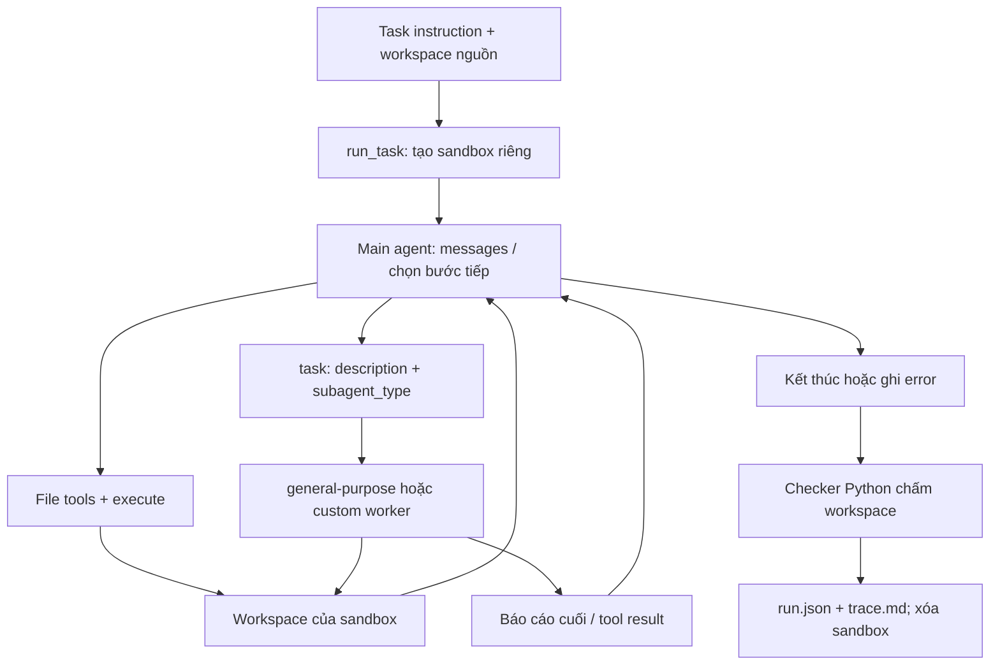

# Báo cáo Day20 — Self evolving Agentic

## 1. Thông tin và cấu hình

| Họ tên | Mã sinh viên | Phần đóng góp |
| --- | --- | --- |
| Trần Quốc Vương | 2A202602522 | Cá nhân: harness, subagents, runner, curator, thí nghiệm và phân tích |

Mô hình `gpt-4.1-mini` qua gateway YesScale tương thích OpenAI; nhiệt độ 0, recursion_limit 60 cho mọi điều kiện. Deep Agents 0.7.21, Python 3.12, Linux trong Docker Desktop trên máy Windows. Key chỉ được truyền vào tiến trình model, không chuyển vào shell của agent. Bài làm tuân thủ README/GUIDE/RUBRIC; chưa thực hiện mở rộng tùy chọn của scaffold chính. Checklist bổ sung Phần 0–6 có báo cáo độc lập và bonus 6c tại [extensions/multiagents/report/FINAL_REPORT.md](../extensions/multiagents/report/FINAL_REPORT.md), không thay thí nghiệm đã freeze.

Python cụ thể 3.12.15, kernel Linux 5.15.167.4 WSL2/glibc 2.41. Mọi lượt chính và development dùng cùng pandas 3.0.6, numpy 2.5.3, python-dateutil 2.9.0.post0 đã cài trước khi đo; package snapshot ở environment.txt. Backend LocalShellBackend virtual_mode=True, inherit_env=False, PATH/HOME tối thiểu, timeout 120 giây; workspace tạm ngoài repo và được xóa khi xong. Thời gian runner bao gồm chuẩn bị sandbox/build/invoke đến khi model kết thúc, không gồm grading cuối; token cộng metadata mọi lượt kể cả subagent.

Commit hypotheses: `1046d17`; tag freeze trỏ `19722e573b8d3ea8dcfd9c7968d068fdbba01b42`, commit 2026-10-06T13:05:56+07:00. Ngân sách được người dùng duyệt không giới hạn; vẫn giới hạn recursion/timeout và số lần curator. Có 18 run chính thức + 3 development = 21 run dùng phân tích, 5 pilot hoàn tất lưu riêng và 1 pilot logs bị dừng; thêm 3 curator và 2 smoke calls (ban đầu và kiểm tra lại Phần 0). Token chính thức 908894, development 181596, curator 21914, pilot có record 468478, smoke 22; tổng metadata có số là 1580904, chưa gồm pilot bị dừng không có usage, không phải hóa đơn đầy đủ. Smoke Phần 0 trả OK, usage 11, lưu setup-model-check.json; không ghi đè hoặc chạy lại benchmark. Không quy token ra USD khi chưa có biểu giá/hóa đơn YesScale; test/tour/loader audit dùng fake model, không tính là paid run.

## 2. Giả thuyết

- H1 (subagents so với baseline): Dự đoán subagents không có điểm evaluation cao hơn baseline một cách ổn định. Tập học giảm 0.3954 → 0.3120, custom roles không được gọi và general-purpose báo hoàn thành không khớp file. Có thể tốn token hơn ở logs dù trung bình học thấp hơn; hướng dẫn 02_subagents cảnh báo isolation và chi phí, không suy con số 15 lần của nghiên cứu sang bài này.
- H2 (skills-auto so với baseline): Dự đoán kỹ thuật tương đương/dao động và không tăng rõ check quy ước trên evaluation; không dự đoán skills-auto sẽ thắng baseline. Development đọc 0 skill ở cả ba tác vụ, code/logs giữ nguyên điểm, data tăng 3/8 → 5/8 dù không có skill data. Hai skill hợp lệ có quy ước tốt nhưng không được đọc thì không có cơ chế truyền lợi ích; token có thể tăng do mô tả skill hoặc thêm vòng suy luận. GUIDE 05 mô tả progressive disclosure; guides/pseudocode/04_curator tóm tắt SkillsBench rằng skill tự sinh trung bình không có lợi (khác skill người viết); đây là căn cứ từ tài liệu lab, không phải bài báo tự kiểm chứng.
- H3 (tác vụ học so với tác vụ đánh giá): Dự đoán không có chuyển giao ổn định, evaluation không vượt learning rõ rệt và quy ước mới dễ thất bại. Development trung bình 0.4787 so với baseline 0.3954 chỉ nhờ data, trong khi rules vẫn 0/9 và skills_read=0; không thể gọi đó là học thành công. Hướng dẫn 04_curator tóm tắt SkillEvolBench về lợi ích learning không chuyển sang task mới; sẽ dùng lần chạy cùng skill sau freeze để tách nhiễu khỏi cải thiện, không xem evaluation trước khi chốt.

Ba giả thuyết ghi trước khi chạy/xem điểm hoặc check riêng evaluation. Test/validator có sẵn truy cập task metadata theo thiết kế, nhưng không đưa nội dung evaluation vào curator hoặc tự xem để chọn skill; không chỉnh H1–H3 theo kết quả sau này.

## 3. Làm quen Deep Agents

Tour dùng model giả, không tốn API. Tool được cung cấp gồm `ls`, `read_file`, `write_file`, `edit_file`, `delete`, `glob`, `grep`, `execute`, `task`; chạy lệnh qua `execute`. Deep Agents mặc định có `general-purpose`, cùng khả năng tool như main agent, nhưng mỗi invocation chỉ nhận prompt giao việc và trả một báo cáo cuối.

Trích tool task: “Each invocation is stateless by default: the agent sees only the prompt you give it and returns a single final report.” Trích execute: “You MUST avoid using search commands like find and grep. Instead use the grep, glob tools to search.” Tour xác nhận system prompt mặc định là chuỗi rỗng; harness này dùng BASE_PROMPT được lab cung cấp, không thay đổi nó.

### Ba câu hỏi của checklist Phần 0

1. **Có bao nhiêu agent, mỗi agent làm gì?** Cấu hình baseline/skills-auto có main agent và general-purpose mặc định. Cấu hình subagents có 5 loại vai trò được cung cấp: main điều phối, general-purpose xử lý việc đa bước, explorer khảo sát đặc tả/dữ liệu và chỉ báo cáo, implementer sửa/tạo đầu ra rồi kiểm chứng, reviewer kiểm tra độc lập và không sửa. Đây là loại agent có thể gọi, không phải 5 tiến trình luôn chạy. Curator là bước gọi model riêng để sinh skill từ feedback học, không phải worker được main giao qua task; grade là checker Python, không phải LLM evaluator.
2. **Coordinator giao tiếp với worker thế nào?** Main gọi tool task với description và subagent_type; framework thực thi invocation subagent, rồi trả báo cáo cuối về main dưới dạng tool result. Không có message queue hay REST API riêng do bài làm triển khai. Subagent chỉ nhận ngữ cảnh được giao, không toàn bộ lịch sử main; main phải truyền đủ đường dẫn, quy tắc, tiêu chí đầu ra và kiểm tra tệp/test trước khi dùng báo cáo. Các worker dùng chung backend workspace của sandbox trong mỗi lượt, không dùng chung workspace nguồn của các task.
3. **Những tool nào được chia sẻ?** Bộ công cụ file/shell gồm ls, read_file, write_file, edit_file, delete, glob, grep và execute; general-purpose có khả năng tool như main, ba worker được khai báo không có bộ tools riêng và sử dụng backend của main. task phục vụ delegation ở main; không giả định mọi worker được delegation đệ quy. Giới hạn chỉ đọc của explorer/reviewer là system prompt, chưa phải access control trên tools. Không có knowledge-base retrieval hoặc logging API riêng được cài: runner thu token/check/trace bên ngoài model. Skill source được đưa vào sandbox chỉ ở skills-auto; không tự động coi custom workers được thừa kế skill của main.

### Kiến trúc tổng thể: đối chiếu thuật ngữ với bài làm

| Thuật ngữ | Chỗ xuất hiện trong hệ thống thật | Giới hạn cần phân biệt |
| --- | --- | --- |
| Agent | build_agent() tạo main bằng create_deep_agent; get_subagents() khai báo explorer, implementer, reviewer, bên cạnh general-purpose mặc định | Vai trò chuyên biệt được cung cấp không có nghĩa đã được model gọi; cả 5 calls của condition subagents trong benchmark đều chọn general-purpose |
| Supervisor / Router | Main LLM chọn tool hoặc kết thúc; tool task định tuyến bằng subagent_type | Không có node Supervisor/router riêng hay chuỗi Researcher → Analyst → Writer do bài làm tự xây |
| Shared state | Main có state messages trong graph; các invocation trong một lượt có thể trao đổi artifact qua cùng workspace sandbox/backend | Không có một dict chứa toàn bộ lịch sử được tự động truyền cho mọi worker. Subagent nhận assignment riêng; sandbox mỗi run tách khỏi các run khác và khỏi task nguồn |
| Handoff | Main giao việc bằng task(description, subagent_type), nhận báo cáo cuối dưới dạng tool result rồi tiếp tục | Đây là delegation và trả kết quả, không phải chuyển quyền điều khiển vĩnh viễn hoặc bàn giao toàn bộ state; main vẫn chịu trách nhiệm kiểm chứng |
| LangGraph | create_deep_agent() trả graph đã compile; runner gọi invoke() với messages và cấu hình giới hạn bước | Framework dựng agent loop; bài làm không thêm workflow node/conditional edge riêng |
| Guardrail | recursion_limit=60; timeout shell 120 giây và model gateway 120 giây; backend không kế thừa env; curator kiểm tên/frontmatter/eval markers; runner so hash skill | 60 là giới hạn bước graph, không phải chính xác 60 vòng Supervisor hay giới hạn 6 vòng. Timeout từng lệnh/request không bảo đảm deadline toàn run; prompt chỉ đọc và kiểm hash sau chạy không phải cơ chế ngăn sửa file |
| Trace | runner lưu trace.md của main và run.json chứa checks, token, giây, counts, error, timestamp, hash | Trace giới hạn 1500 ký tự/message và không có tool nội bộ worker; token callback vẫn cộng worker. Không thể dùng trace này như toàn bộ lịch sử input/output mọi agent |
| Benchmark | Cùng 6 task, cùng model/nhiệt độ/recursion, ba conditions baseline/subagents/skills-auto; checker chấm partial credit, compare tổng hợp | Quality là check tự động, cost là token metadata; không có LLM judge hoặc số USD được xác minh. Learning và evaluation tách trước/sau freeze |

Luồng chạy một task; các cạnh tool/delegation chỉ được đi khi model chọn, không bắt buộc đi qua mọi worker:



Self-evolving là luồng khác, không nằm trong vòng delegation: baseline learning feedback/trace → curator model → validate_skill → skills/auto → development → hypotheses/freeze → skills-auto official. Curator đổi tri thức thủ tục trong context, không huấn luyện trọng số model. Ví dụ “trưởng nhóm và hồ sơ chuyền tay” giúp hiểu khái niệm, nhưng không thay thế hợp đồng context isolation và evidence của implementation này.

## 4. Đường cơ sở và phân loại lỗi

Chỉ dùng ba run baseline học đã chuẩn hóa LF; evidence là `results/baseline/<task>/run.json` và `trace.md`. Đây là toàn bộ 16 check thất bại, không phải một mẫu chọn lọc.

| Tác vụ | Check thất bại | Nhóm | Evidence từ detail / trace |
| --- | --- | --- | --- |
| code-learn | rule_type_hints | E | “every public function ... type annotations on all parameters and on the return value” |
| code-learn | rule_regression_tests | E | “add tests/test_regressions.py ... at least 3”; trace chỉ chạy bộ test gốc |
| code-learn | rule_changelog | E | “CHANGELOG.md ... ## Unreleased ... - fix(<function name>): ...” |
| data-learn | north_q1_revenue | D | “wrong value (got 2314.87)”; process_sales.py dùng parser.parse(d), không chỉ định DD/MM/YYYY |
| data-learn | north_q1_orders | D | “wrong value (got 9)”; cùng lỗi chọn ngày/quý khi parser mặc định month-first |
| data-learn | rule_money_in_cents | E | “money values in answer.json are integer cents”; trace xuất doanh thu thập phân |
| data-learn | rule_meta_block | E | “meta ... source ... rows_in ... rows_used”; answer.json không có meta |
| data-learn | rule_clean_csv | E | “header order_id,timestamp_utc,region,amount_cents”; trace chỉ ghi answer.json |
| logs-learn | entry_count | D (B phụ) | “wrong number of entries (got 19)”; đọc log rồi chép JSON bằng write_file, không chạy parser |
| logs-learn | timestamps_utc | D (B phụ) | “8/25 timestamps match”; JSON chép tay không chuyển offset đúng |
| logs-learn | exception_fields | D (B phụ) | “17 wrong exception values”; không kiểm chứng liên kết traceback với entry |
| logs-learn | repeat_counts | D (B phụ) | “17 wrong repeat_count values”; không kiểm chứng dòng lặp với entry trước |
| logs-learn | counts_by_service | D (B phụ) | “wrong values”; tổng theo service dựa trên entries/repeats sai |
| logs-learn | rule_service_names | E | “lower-case with '-' replaced by '_'”; JSON giữ payment-service |
| logs-learn | rule_sorted_errors | E | “sorted by service, then by timestamp_utc, ascending”; giữ thứ tự log |
| logs-learn | rule_schema_header | E | “schema_version: 2 ... generated_by: log-triage”; thiếu header |

Nhóm chính E chiếm 9/16 (56.25%); D chiếm 7/16. Skill có thể truyền quy ước ẩn E nhưng vẫn cần workflow kiểm chứng D/B. Kỹ thuật baseline đạt 11/18: code 7/7, data 3/5, logs 1/6; quy ước đạt 0/9. Code đạt cả other_caller_fixed và hai docstring checks là bằng chứng phủ định cho việc quy toàn bộ lỗi thành A/C. Data đã sửa lỗi datetime aware/naive nhưng không sửa ngày nhập nhằng: chạy lệnh nhiều lần không đồng nghĩa kiểm chứng đúng. Logs không có execute trong trace, nên B là nguyên nhân thứ cấp có evidence; không suy nội dung không xuất hiện trong trace.

Tách hạ tầng: các pilot `*-crlf-pilot` không nằm trong bảng chính hoặc đầu vào curator. Windows CRLF làm hash test khác LF dù test không bị agent sửa; khắc phục bằng runtime Linux lấy bytes từ Git, không đổi checker/hash/task. Pilot subagents logs bị dừng khi chẩn đoán, không có run hoàn tất; không dùng làm lỗi của agent.

## 5. Điều kiện subagents

Mục 5 về **Test Results** của tài liệu bổ sung Phần 5 nằm ở `extensions/multiagents/report/REPORT.md:5`, tách khỏi phân tích condition subagents đã đo/freeze.

Định nghĩa explorer đọc đặc tả/dữ liệu nhưng không sửa; implementer thực hiện bước có phạm vi rõ và kiểm chứng; reviewer kiểm tra độc lập nhưng không sửa. Description nêu thời điểm nên giao việc; build_agent thêm PATHS_NOTE cho mỗi subagent. Main agent vẫn tự quyết định có gọi subagent; số liệu lấy từ trace và subagent_calls.

| Tác vụ học | Baseline token | Subagents token | Calls task | Subagent thực sự gọi | Điểm baseline → subagents |
| --- | ---: | ---: | ---: | --- | --- |
| code-learn | 32826 | 35871 | 0 | Không | 7/10 → 7/10 |
| data-learn | 150119 | 47998 | 1 | general-purpose | 3/8 → 1/8 |
| logs-learn | 24808 | 73216 | 2 | general-purpose | 1/9 → 1/9 |

Không có bằng chứng custom explorer/implementer/reviewer được dùng ở tập học. code-learn tự làm và qua kỹ thuật; lời nhắc delegation không bắt buộc được model làm theo. Data truyền đủ đường dẫn, định dạng ngày, sentinel, khoảng UTC và quy tắc dedup; nhưng câu “Follow Acme reporting conventions” không chứa quy ước ẩn chưa biết. Subagent trả “I will proceed ...” kèm code chứ không chứng minh đã chạy; main đọc answer.json thấy “not found”, rồi tự ghi số mà không execute/đối chiếu. Logs hai lần subagent nói “output has been written”; main đọc lại mỗi lần chỉ thấy `{}`, không phải file mất tích. Đây là bằng chứng F ở báo cáo subagent; main phát hiện nhưng chỉ giao lại cùng yêu cầu rồi chép JSON tay, không xác minh kết quả cuối. Luồng trong subagent không có trong trace nên không khẳng định nó đã chạy lệnh nào.

Token trung bình tập học giảm 69251 → 52361 (-24.39%) nhưng điểm trung bình giảm 0.3954 → 0.3120; logs riêng tăng 2.951 lần token, data giảm còn 0.320 lần nhưng mất 2 check. Thời gian code/data/logs là baseline 40.4/116.8/41.5 giây, subagents 23.7/56.9/54.8 giây. Không gọi đây là cải thiện chi phí có cùng chất lượng, hay hiệu quả của vai trò chuyên biệt.

| Tác vụ đánh giá | Baseline token | Subagents token | Calls task | Subagent thực sự gọi | Điểm baseline → subagents |
| --- | ---: | ---: | ---: | --- | --- |
| code-eval | 19655 | 31677 | 0 | Không | 7/11 → 7/11 |
| data-eval | 78992 | 70750 | 1 | general-purpose | 5/9 → 0/9 |
| logs-eval | 21989 | 24370 | 1 | general-purpose | 1/10 → 0/10 |

Evaluation cũng không dùng custom roles. Data giao yêu cầu và output path nhưng thiếu đường dẫn workspace/ trước orders.json ở phần đầu; subagent và main trả chuỗi `{"tool_uses": ... "functions.write_file" ...}` trong content, không có tool call write_file thực sự hoặc kiểm tra tệp. Check top_category cũng fail dù câu trả lời nêu toys: trả đúng chữ trong chat không thay cho artifact answer.json. Logs giao đủ level mới ERROR/SEVERE/FATAL và separator, nhưng main tự write_file với keys `entries`/`timestamp` thay vì `errors`/`timestamp_utc`, không execute; valid_structure fail kéo mọi check còn lại fail. Code tự sửa và chạy lại test sau khi sửa PYTHONPATH; đó là hiệu quả single-agent trong condition subagents, không chứng minh delegation tốt.

## 6. Self-evolving

Mục 6 về **Performance Analysis** của tài liệu bổ sung Phần 5 nằm ở `extensions/multiagents/report/REPORT.md`, tách khỏi protocol curator/hypotheses/freeze của thí nghiệm này.

Curator chạy 3 lần (lần đầu và đúng 2 lần chạy lại được phép). Cả ba chỉ đọc baseline role=learn không có error; mỗi prompt gồm failed name/detail và 6000 ký tự cuối trace, không dùng pilot hoặc evaluation. Prompt/reply/usage thật lưu ở `report/curator_01.json` đến `curator_03.json`. Các skill đã ghi của hai lần đầu chuyển nguyên trạng sang `report/curator-rejected-01/` và `curator-rejected-02/`, không sửa nội dung.

- Lần 1: 3 skill hợp lệ nhưng tách annotations/regression làm hai, không có changelog hoặc logs; skill data dùng sentinel cụ thể và dedup row chung chung. Loại cả 3 để curator bao phủ workflow, giữ chính xác quy ước thay vì chi tiết input.
- Lần 2: giữ được 2 skill code; skill data bị validate_skill từ chối vì chuỗi `orders` trùng định danh eval. Không chủ động xem eval: đây là thông báo validator có sẵn, từ khớp một danh từ phổ thông trong feedback học. Lần này vẫn bỏ sót logs và có chỉ dẫn commit/static checker không bảo đảm tồn tại. Loại 2 file đã ghi; sửa prompt tổng quát để gom workflow và tránh tên miền dữ liệu riêng.
- Lần 3: sinh code/data/logs, nhưng data vẫn bị validator loại vì `orders`; giữ 2 skill hợp lệ code/logs. Không chạy lại lần thứ tư và không sửa tay để lách validation. Raw reply lưu cả khối bị từ chối để minh bạch; chỉ 2 file trong skills/auto được nạp. So bytes với block cuối có thêm newline: cả hai exact_model_output=True, validate_skill=[]; hash Linux `9be2711716937db8adb26385ceb3e43c011bfdc7d7e3d243186d420363f20dca`.

| Skill giữ lại | Tổng quát / tình huống description | Đúng và giới hạn | Độ dài |
| --- | --- | --- | --- |
| code-changes-with-testing-and-changelog | Use when modifying code; không nêu tên hàm hoặc input cụ thể | Đúng type hints, tests/test_regressions.py, CHANGELOG.md/Unreleased/format fix; không nhắc minimum 3 và “before committing” không hợp sandbox không có Git; mở rộng fix-format cho feature không được feedback chứng minh | 13 dòng tổng, 9 dòng body |
| structured-log-parsing-and-normalization | Use when parsing raw log files; quy trình xuyên dataset | Đúng UTC, nối multiline, chuẩn hóa service, sort và schema; bước repeat chưa nêu cộng 1, không nêu rõ counts_by_service/level upper-case, “expected values” không nên hiểu là có đáp án tham chiếu. Output errors.json là quy ước được phép | 20 dòng tổng, 16 dòng body |

Hai description có trigger rõ, ngắn hơn 40 dòng; hợp format không có nghĩa đầy đủ hoặc chắc chắn được đọc. Không có skill data hợp lệ là hạn chế thật, không bù bằng skill tự viết.

Sau freeze mới đối chiếu evaluation: skill logs cố định ERROR/CRITICAL và vị trí message của format học, trong khi evaluation dùng ERROR/SEVERE/FATAL và separator ` | `. Đây là nguy cơ quá khớp thủ tục, không phải leakage; nên tham số hóa bằng specification hiện tại trong thí nghiệm tiếp theo. Không sửa skill đang nộp. Không có read_file body code/logs trong trace luồng chính development/official (0/3 và 0/6); development logs gọi một general-purpose nên việc đọc ở bên trong nó không quan sát được. Sáu skills-auto chính thức không gọi subagent hoặc đọc skill bằng shell. Loader audit offline xác nhận hai tên skill và FIRST action note thật sự có trong system prompt (`skill-loader-check.json`), nên không quy lỗi này cho việc quên nạp skills.

Development code/data/logs đạt 7/10, 5/8, 1/9 với 85790/37614/58192 token; skills_read=0 cả ba, skills_modified=false, error=null. Trace code bắt đầu ls workspace rồi đọc package chứ không đọc SKILL.md; data tạo và chạy process_sales.py với phân nhánh định dạng ngày, không có skill data; logs giao general-purpose rồi đọc output không đủ, tự ghi JSON. Trung bình điểm 0.4787, token 60532; quy ước 0/9, kỹ thuật 13/18. Giữ nguyên bộ skill và toàn bộ kết quả này ở skills-auto-dev trước freeze; không coi tăng điểm data là tác động của skill chưa đọc.

## 7. Kết quả so sánh

Bảng dưới sao nguyên output `python -m lab.compare`, artifact `report/table.md`. Mean score là trung bình điểm từng task, không phải lấy tổng passed chia tổng checks; mean tokens của script lấy phần nguyên.

| Task | baseline | subagents | skills-auto |
|---|---|---|---|
| code-learn | 7/10 | 7/10 | 7/10 |
| data-learn | 3/8 | 1/8 | 3/8 |
| logs-learn | 1/9 | 1/9 | 1/9 |
| code-eval | 7/11 | 7/11 | 7/11 |
| data-eval | 5/9 | 0/9 | 5/9 |
| logs-eval | 1/10 | 0/10 | 6/10 |
| **Mean score - learning tasks** | 0.40 | 0.31 | 0.40 |
| **Mean score - evaluation tasks** | 0.43 | 0.21 | 0.60 |
| **Mean tokens per run** | 54,731 | 47,313 | 49,437 |
| **Runs that read a skill** | 0/6 | 0/6 | 0/6 |

Output nguyên của `python scripts/check_breakdown.py` (cũng lưu check-breakdown.txt):

```text
condition     role    technical  house rules  mean tokens  read a skill
baseline      eval     13/18         0/12          40,212      0/3
baseline      learn    11/18         0/9           69,251      0/3
subagents     eval      7/18         0/12          42,265      0/3
subagents     learn     9/18         0/9           52,361      0/3
skills-auto   eval     18/18         0/12          50,065      0/3
skills-auto   learn    11/18         0/9           48,809      0/3
```

18/18 run chính thức có run.json và trace.md không rỗng, tokens.total > 0, error=null, skills_modified=false. Không chạy lại vì điểm thấp; ngay cả data-eval/logs-eval 0 điểm của subagents vẫn giữ. Sáu skills-auto cùng hash đã freeze, timestamps sau tag; verify_freeze: `checked 6 runs of skill conditions: OK` (freeze-check.txt). Development có ba run riêng, hash giống sáu run chính thức. Không task chính thức nào đạt mọi check; các score là partial credit, khác với 29 test kiểm tra harness đều pass.

## 8. Phân tích

### 8.1. Học và chuyển giao; đối chiếu giả thuyết

Điểm học chính thức baseline và skills-auto cùng 0.3954; subagents thấp hơn ở 0.3120. Evaluation skills-auto cao nhất 0.5973, baseline 0.4306, subagents 0.2121. Chênh skills-auto–baseline evaluation là +0.1667 (+16.67 điểm phần trăm), hoàn toàn từ logs-eval 1/10 → 6/10; code/data không thay đổi. H1 phù hợp quan sát: condition subagents thấp hơn baseline 21.85 điểm phần trăm evaluation, nhưng không phải phép thử thành công các custom roles vì không được gọi. H2 đúng về rules không tăng, sai về xếp hạng điểm thô: skills-auto dẫn evaluation, không đủ bằng chứng quy kết cho skill body chưa được đọc. H3 không phù hợp xếp hạng thô: skills-auto eval 0.5973 > learn 0.3954; đây không chứng minh chuyển giao vì bộ việc/check khác nhau và logs thay đổi chiến lược.

Development skills-auto học tăng 0.3954 → 0.4787 so với baseline, nhưng lần freeze học mất hết chênh lệch. Không có condition nào trong bảng chính tăng learning rồi giảm evaluation so với baseline; có dấu hiệu cải thiện development không bền khi chạy lại. Không gọi chênh lệch đó là học thành công hoặc khẳng định quá khớp thống kê từ một lượt.

### 8.2. Kỹ thuật và quy ước

Skills-auto evaluation đạt kỹ thuật 18/18 so với baseline 13/18, subagents 7/18; rules vẫn 0/12 cho cả ba. Learning rules 0/9 cho cả ba, kỹ thuật skills-auto/baseline đều 11/18. Curator đã truyền rules về type hints/regression/changelog/service/schema/sort vào hai file, nhưng model không đọc file nào nên chưa thấy cải thiện ở những rules này. Rules mới evaluation là rule_version_bump, rule_sorted_keys_format và rule_source_line: đều fail cả ba; chúng không nằm trong feedback học hoặc bộ skill giữ lại, không nên trông chờ tự suy đúng quy ước ẩn. Curator không giữ được skill data nên money/meta/clean.csv cũng không được cung cấp bằng body skill hợp lệ.

### 8.3. Cơ chế trong trace: đọc chưa chắc làm, lần này chưa đọc

Không có check nào mà dữ liệu chứng minh “đọc và làm theo body skill giúp đạt”; báo cáo không bịa một ví dụ dương để đủ mẫu. Ví dụ dương **về workflow**: skills-auto/logs-eval đạt timestamps_utc và repeat_counts, trace viết parse_logs.py, gọi `python3 workspace/parse_logs.py` thành công rồi đọc errors.json; script chuyển UTC, bắt level mới và gắn repeats với entry. Baseline/logs-eval chỉ đọc log và write_file JSON tay, không execute; khác biệt 6/6 so với 1/6 kỹ thuật phù hợp workflow này. Đây là tương quan với chiến lược chạy script, không bằng chứng nhân quả của skill.

Ví dụ âm rõ: code-changes-with-testing-and-changelog có step 1 full annotations nhưng rule_type_hints fail ở code-learn và code-eval; model bắt đầu ls workspace/package, đọc code và sửa logic, không đọc SKILL.md (skills_read=0). Skill logs step 3 lower-case/thay '-' bằng '_' và step 10 schema header cũng không giúp: logs-eval giữ queue-worker, không schema_version/generated_by; rule_service_names/rule_schema_header đều fail. Không phải trường hợp đọc rồi cố tình bỏ rule; không có body read để kết luận vậy. Metadata/description skill có thể ảnh hưởng ngữ cảnh ngay cả khi không đọc body, nên cũng không khẳng định hoàn toàn không có tác động: cần ablation/lặp lại mới xác định.

### 8.4. Token, thời gian và hiệu quả

Định nghĩa efficiency = 10000 × tổng score / tổng token trong cùng nhóm (tương đương mean score/mean tokens × 10000); không đồng nhất với USD hay latency.

| Condition | Mean token học | Mean token eval | Mean token tất cả | Mean giây tất cả | Score/10k token tất cả | Score/10k token eval |
| --- | ---: | ---: | ---: | ---: | ---: | ---: |
| baseline | 69251.00 | 40212.00 | 54731.50 | 51.33 | 0.07546 | 0.10709 |
| subagents | 52361.67 | 42265.67 | 47313.67 | 51.02 | 0.05539 | 0.05019 |
| skills-auto | 48809.00 | 50065.33 | 49437.17 | 37.68 | 0.10040 | 0.11931 |

Skills-auto có efficiency quan sát tốt nhất, mean token toàn bộ thấp hơn baseline 9.67%, nhưng **riêng eval** đắt hơn 24.50% và được thêm 5 check kỹ thuật logs. Subagents toàn bộ rẻ hơn baseline 13.55% nhưng score thấp hơn 0.4130 → 0.2621; eval đắt hơn 5.11% và efficiency chưa bằng nửa baseline. Trong lần đo này delegation không đáng chi phí/chất lượng: 5 task calls đều general-purpose, không kiểm chứng đủ output; không suy mọi thiết kế multi-agent đều kém. Mean thời gian không đại diện latency production vì chạy nối tiếp, bao gồm build/sandbox và phụ thuộc gateway. Token curator 21914 là chi phí học một lần chưa tính vào efficiency theo task; nếu tính chi phí xây skill, lợi thế deployment nhỏ càng cần thận trọng.

### 8.5. Rò rỉ và quá khớp

Chỉ lấy role=learn/source baseline, không lấy pilot hoặc record error; curator chưa chạy trên eval. Không xem eval checker/score để chọn skill trước hypotheses/freeze; sau freeze mới mở checker để phân tích rules mới. validate_skill chặn eval markers, safe name chặn traversal, raw output giữ nguyên và chỉ ghi block hợp lệ. `orders` bị chặn là false positive theo ngữ cảnh feedback học: danh từ có trong RULE/trace học, không bằng chứng rằng curator đã nhận eval input; không sửa validator để lách. Git history lưu thời điểm H1–H3 và skill trước mọi run eval; final audit đối chiếu model reply, skills bytes và hash/timestamps, không phát hiện key trong artifacts/Git history.

Nguy cơ overfitting có thật ở level/date/source-format thủ tục, sentinel -999 và dedup rows của các khối data bị loại; skill logs giữ level/form học quá cụ thể. Vì hai body cuối không được đọc, không thể dùng kết quả hiện tại chứng minh overfitting gây score giảm. Có nhiều nguồn khác như model noise, task difficulty và schema viết sai; loại chúng cần nhiều lượt/ablation.

### 8.6. Nhiễu của cùng bộ skill

| Tác vụ học | Development trước freeze | Chính thức sau freeze | Delta score | Token dev → final |
| --- | --- | --- | ---: | ---: |
| code-learn | 7/10 | 7/10 | 0.0000 | 85790 → 86661 |
| data-learn | 5/8 | 3/8 | -0.2500 | 37614 → 33508 |
| logs-learn | 1/9 | 1/9 | 0.0000 | 58192 → 26258 |
| Trung bình | 0.4787 | 0.3954 | -0.0833 | 60532 → 48809 |

Cùng hash, model, nhiệt độ 0, recursion và package versions, nhưng data mất hai check: trace development dùng `datetime.strptime(..., "%d/%m/%Y")`, sau freeze dùng parser.parse mặc định; doanh thu/số đơn lại sai. Logs development có một general-purpose call, final không có; score như nhau nhưng token giảm mạnh. Đây là một cặp đo dao động workflow, không phải ước lượng variance/CI đáng tin cậy; chênh lệch 8.33 điểm phần trăm mean learning cho thấy không nên gán mọi delta cho skill. Evaluation tăng 16.67 điểm phần trăm vẫn cần chạy lặp và kiểm soát strategy để kết luận nhân quả.

## 9. Hạn chế

1. Chỉ ba task mỗi role, một model và một lượt chính mỗi condition; denominator/check difficulty khác nhau, không có confidence interval, không suy tổng quát mọi dự án hoặc provider.
2. Nhiệt độ 0 không bảo đảm tất định model/gateway; cặp development/final cho thấy mất 2/8 check data với skill không đổi. Evaluation gains có thể do chiến lược/nhiễu, không chứng minh learning.
3. Custom subagents không được gọi và skill bodies không được đọc; thử nghiệm đo tác tử được **cung cấp** cải tiến chứ không bảo đảm cải tiến được dùng. Không đủ kiểm chứng hiệu quả thiết kế ba roles hoặc nội dung skill khi tuân thủ.
4. Task có quy ước tổ chức ẩn và rules mới; score phạt điều model không biết và phản ánh khả năng lấy knowledge qua curator, không chỉ chất lượng kỹ thuật. Validator common-word false positive làm mất hẳn skill data.
5. Trace do render_trace có sẵn giới hạn 1500 ký tự/message, chỉ main flow; không thấy tool nội bộ subagent. skills_read đếm read_file main, không shell reads; đối chiếu các execute trong trace không thấy đọc skill bằng shell. Token cộng mọi LLM call nhưng tool_calls không gồm subagent internal; không so số tool như tổng số hoạt động thực tế.
6. Linux canonical runtime xử lý CRLF trước official, package snapshot/pins giảm lệch dependency, nhưng gateway và package phụ có thể thay đổi ở lần cài sau. Môi trường dùng chung container với sandbox file riêng, không phải reset toàn OS từng lượt; không thấy official agent cài thêm package trong trace. Key không vào shell env nhưng LocalShellBackend/container chung không phải sandbox chống mã độc; không dùng harness này cho input không tin cậy production.

## 10. Kết luận

Harness đã chạy đủ 18 run thật, qua 29 test offline và verify_freeze kiểm sáu run đúng bộ skill. Skills-auto dẫn evaluation 0.5973 so với baseline 0.4306, nhưng lợi ích quan sát chỉ ở kỹ thuật logs, không có body skill được đọc và rules vẫn 0/12. Subagents condition thấp nhất evaluation 0.2121, các custom roles không được dùng và delegation general-purpose thiếu kiểm chứng output. Chênh lệch development/final learning 8.33 điểm phần trăm ngăn việc gọi mọi gain là self-evolution. Bước tiếp theo nên là thí nghiệm riêng ép đọc skill, tham số hóa parser theo specification và lặp nhiều lượt với ablation, không sửa bộ skill đã freeze của bài này.

## Phụ lục

Lệnh theo thứ tự (Linux runtime trong Docker; chi tiết Windows/credentials ở REPRODUCE.md):

```text
python -m pytest tests/ -q
python scripts/tour.py
python -m lab.runner --condition baseline --tasks learn
python -m lab.runner --condition subagents --tasks learn
python -m lab.curator                     (3 lần, evidence model invoke lưu riêng)
python -m lab.runner --condition skills-auto --tasks learn
mv results/skills-auto results/skills-auto-dev
git commit -m hypotheses
git commit --allow-empty -m "freeze skills"
git tag freeze
python -m lab.runner --condition baseline --tasks eval
python -m lab.runner --condition subagents --tasks eval
python -m lab.runner --condition skills-auto --tasks all
python scripts/verify_freeze.py
python -m lab.compare > report/table.md
python scripts/check_breakdown.py
python -m pytest tests/ -q
python -m pip check
```

29 test offline pass cả trước/sau, tour và pip check thành công; output Phần 5 ở offline-tests-final.txt, pip-check.txt, freeze-check.txt; tự kiểm Phần 6 lưu riêng offline-tests-part6.txt và freeze-check-part6.txt. Dockerfile.day20 bổ sung Git/dependency data, Dockerfile gốc và mọi file được cung cấp giữ nguyên; protected files và AST prompt/render_trace/main/validator/parser được kiểm chứng so với d982034. Statistics.json ghi số chính xác không làm tròn; final-audit.json kiểm 18 record/trace, score/token, model-generated bytes, bảo mật và lịch sử; checklist bàn giao ở CHECKLIST.md. Prompt thực hiện nằm ở IMPLEMENTATION_PROMPT.md. Không làm bonus tùy chọn của thí nghiệm chính; extension có bonus 6c riêng của checklist bổ sung. Không push GitHub hoặc nộp VLearn trước khi người dùng kiểm tra; giữ nguyên history/tag khi xuất bản sau duyệt.

### Mở rộng Phần 2/3 sau freeze: Coordinator, Workers và Communication

Tài liệu bổ sung yêu cầu Coordinator class, BaseWorker, Data/Code/Evaluator workers và message queue, nhưng scaffold chính dùng Deep Agents delegation và không cung cấp những module đó. Đã triển khai riêng trong `extensions/multiagents/`, không sửa `src/lab/`, root `tests/`, tasks, scripts, hypotheses hoặc skills đã freeze. Phần mở rộng không là một condition của bảng benchmark, không dùng để nhận bonus của thí nghiệm self-evolving chính hoặc giải thích ngược các run đã đo.

Coordinator parse/route/execute/aggregate/retry qua queue async có correlation `run_id`/`task_id`/sender, deadline, cancellation, partial results và retry chỉ task idempotent. Worker có prompt/tool schemas riêng; BaseWorker xử lý mọi tool call và giữ history đúng call IDs. Data thực thi CSV/pandas/SQLite read-only; Code tạo/sửa file và chạy Python giới hạn thời gian/tài nguyên; Evaluator tính trọng số 30/30/20/20 và kiểm JSON phản hồi. Queue bounded, kiểm JSON/size và giữ bản sao log.

Checkpoint Phần 4 có **43 test offline pass** (30 ở checkpoint Phần 3; hiện có 68 sau Phần 6), standalone Coordinator **3/3**, và checkpoint bốn hành vi worker **4 passed** (bốn test khác deselected). Evidence ở `extensions/multiagents/evidence/`. Integration Phần 3 chạy pandas aggregate thật và script thật tạo `report.txt` có tổng 30, trao đổi qua queue và kiểm file đầu ra; model/evaluator vẫn là scripted fixtures, không chứng minh chất lượng suy luận hoặc factual accuracy. Không gọi thêm API trả phí để làm phần này.

Python subprocess không là sandbox chống mã độc; chỉ chạy trusted code trong Linux/container hạn quyền. Async cancel không giết sync thread; queue không persistent/distributed, log có thể chứa dữ liệu caller gửi, task cùng worker chạy nối tiếp và dependency cần chia stage. Chi tiết thực thi, commands và giới hạn ở `extensions/multiagents/README.md`; checklist riêng ở `CHECKLIST.md`. 29 test harness và 18 run chính thức vẫn được kiểm độc lập, không trộn với 43 test extension. Chưa commit/push phần mở rộng, dừng chờ kiểm tra.

### Phần 4: Tool integration và collaboration ngoại tuyến

BaseTool chuẩn hóa schema/validate/invoke/async và metadata logs không chứa raw query/code/content. QueryDatabaseTool cache connection SQLite mode=ro, khóa RLock cho các async thread calls, authorizer chặn writes/DDL/load_extension, progress/deadline và fetch limit; không thêm LIMIT gây lỗi khi query có sẵn LIMIT. Owner đóng cache khi xong. DataAgent thêm AggregationTool; CodeAgent dùng concrete Python/create/edit/script tools; Evaluator thêm scalar reference comparison và Markdown report, giữ validation/quality/feedback cũ. Score tính từ criterion ratings, không dùng độ dài câu trả lời làm accuracy.

Checkpoint tools **4/4 pass** và demo **3/3 pass**, tổng extension **43 tests** gồm resource-limit/output-truncation, SQL cache concurrency/timeout/recovery, report validation/path/overwrite và collaboration. Script `extensions/multiagents/scripts/test_tool_integration.py` dựng SQLite thật có 50 sales 2026 và một sale 2025, lấy riêng 2026: **50 rows, total 1275**. Code Agent nhận các amounts từ SQL qua task, chạy matplotlib Agg tạo PNG thật **11765 bytes**, stdout xác nhận total **1275**; Evaluator comparison đối chiếu kết quả với reference SQL rồi report_generator ghi `evaluation.md`. Có sáu messages ở ba batch data → code → evaluator. Ratings 85/90/80/85 là demo inputs, phép tính 30/30/20/20 cho **85.5/B**, không là đánh giá accuracy LLM.

Output thật và demo artifacts ở `extensions/multiagents/evidence/`; PNG được Pillow verify, không dùng ảnh mẫu. Venv `/opt/day20-tools-venv` bổ sung matplotlib mà không đổi package runtime chính; không API/key. Python execution có timeout/memory/CPU/file-size/FD limits, không kế thừa secrets, giữ đúng script `__file__`/main/sibling imports và truncation flags. Không coi subprocess/import blacklist là security sandbox; code vẫn có quyền filesystem/network của container. Hướng dẫn chạy lại không ghi đè artifacts trong README extension; code và bảng benchmark đã freeze không đổi.

### Phần 5: Test, Debug và Performance bổ sung

MultiAgentSystem bọc fixture workflows với request-local model/workers/queue/database/workspace, max_concurrency=4 và deadline toàn request. Thêm E2E/ten-concurrent/cancel/reuse/quote-env/token/statistics/artifact tests, **57/57 pass**, **92.2535% statement coverage** package extension, không API trong test. Debug scripts lưu structured logs/spans/artifact hashes; profiling năm request lưu riêng. Không thay src/lab, root tests, tasks/scripts, H1–H3 hoặc skills/results đã freeze.

Benchmark mới ba case × ba iterations + mười concurrent data requests; **offline 19/19** nhưng **live 17/19**. Live simple avg **3.465s**, code **8.148s**, complex **24.752s**; concurrent data **10/10**, P50 **6.251s**, P99 **12.442s**, **47.09 req/min**. Token live cuối **45316** từ usage metadata (66 logical invocations); USD null do chưa có tariff/invoice YesScale. Lỗi còn lại: answer rows là list thay integer, và model dùng import os như REPL giữ state. Không che lỗi, không tuyên bố đạt error/latency target production hoặc gán kết quả này vào condition skills/subagents của bài chính.

Giữ cả run setup/schema lỗi trước sửa và run cuối, schemas/assignment được sửa ở root cause, không thay dữ liệu/checks để lấy điểm đẹp. Báo cáo bổ sung **mục 5–6** ở `extensions/multiagents/report/REPORT.md` có bảng min/max/avg/median/P99/token/throughput/errors, utilization định nghĩa rõ, logs, profiling và evidence từng lỗi. Commands ở README extension và REPRODUCE.md. Chưa commit/push; dừng chờ người dùng kiểm tra.

### Phần 6: Báo cáo cuối và bonus độc lập

[Báo cáo cuối bổ sung](../extensions/multiagents/report/FINAL_REPORT.md) đáp ứng đủ 10 mục và hai sơ đồ architecture/message flow, protocol, implementation/trade-offs, test results, performance/resource measurements, errors/resilience, design-vs-reality, scalability, limitations và next steps. Không thay mười mục của báo cáo self-evolving này hoặc trộn fixture benchmark với six-task benchmark.

Chọn bonus **6c — Result caching** trong extension: chỉ verified readonly structured data requests; key có trusted scope/dataset revision/policy namespace, TTL/LRU/size bounds, bỏ qua side effects/debug/errors, hit không phát lại files/traces/token counters. **68/68 tests pass**, statement coverage **92.6650%** (1137/1227), giữ snapshot 57-test Phần 5. Offline cache/no-cache cùng fixture 20 requests mỗi nhánh **20/20**, mean **17.998 → 0.942ms**, scripted model calls **40 → 2**; không suy ra tiết kiệm live USD/token hoặc bonus đã được chấm. Resource probe Linux offline **13/13**, parent sampled peak 94272–98932 KiB, CPU/RSS methods và limitations trong báo cáo.

Benchmark live vẫn **17/19**, hai lỗi rows list/REPL state và production SLO chưa đạt; không gọi API mới hoặc refreeze để làm đẹp số. Core, protected files và skills được tự kiểm riêng; evidence/checklist/commands cập nhật. **Chưa commit/push các kết quả cuối/báo cáo/extension hoặc nộp VLearn; dừng để người dùng kiểm tra.**

### Cập nhật xuất bản — 2026-10-06

Sau bàn giao Phần 6, người dùng yêu cầu push. Commit **`09b6e16`** chứa kết quả/báo cáo/extension đã được push lên https://github.com/Neon310304/K4-DAY20-MULTIAGENTS-TranQuocVuong-2A202602522 cùng tag `freeze`; đã đối chiếu hash remote. Lịch sử hypotheses/freeze, skills và benchmark giữ nguyên; các ghi chú “chưa push” ở checkpoint trước là trạng thái tại lúc bàn giao, được cập nhật bởi mục này. `.env` không được track hoặc push; audit không phát hiện credential trong artifacts/Git trước xuất bản. **Chưa xác nhận nộp link VLearn.**
